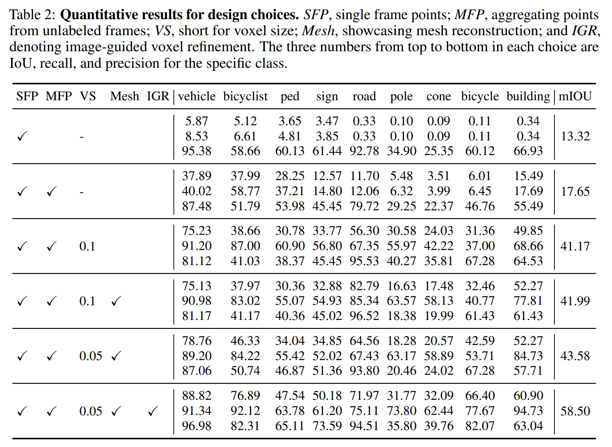

## Occ3D
https://tsinghua-mars-lab.github.io/Occ3D/
Occ3D: A Large-Scale 3D Occupancy Prediction Benchmark for Autonomous Driving
重点关注其数据集
提出了一个更为通用的Occ数据生成方式，可以用于生成不同场景下的高密度、所见即所得的Occ数据。主要包括三个步骤：1）体素稠密化，2）遮挡推理，3）图片引导refine
### Method
分别基于nuscenes和waymo数据集生成Occ数据集，具体参数如图:
除了原有数据集中分割的类别，还增加了通用类别(general object，GO)的标注。
其中，nuscenes数据集的标注范围为[-40m, -40m, -1m, 40m, 40m, 5.4m]； waymo的标注范围为[-80m, -80m, -1m, 80m, 80m, 5.4m]
**Dataset Construction Pipeline**
完整的数据生成流程如图所示：

由于图像缺乏可靠的深度和尺度信息，因此仅利用图像进行Occ真值生成是不可能的。因此本文利用点云和其分割结果重建高质量的Occ真值，并解决了几个关键问题：1） 点云稀疏性问题，2） 遮挡问题，3） 点云与图像之间的对齐问题。
-  Voxel Densification
1. 关键帧叠帧，并对动/静态物体分开处理
2. 引入非关键帧，利用KNN分配对应标签
3. 表面重建
    对于非地面目标，使用VDBFusion进行表面重建；但对于地面目标，VDBFusion 会因光线角度过小导致 TSDF值不正确而失败。因此，本文将地面划分为多个区域，利用区域内的点来拟合表面网格进行泊松重建。
    重建网格后，进行密集点采样，并再次利用KNN为采样点分配标签。

- Occlusion Reasoning for Visibility Mask
本文提出了遮挡推理，并分别应用于雷达和相机视角，从而生成可见性掩码。

由于点云的稀疏性，很容易将空洞误以为是"free"，因此本文采用叠帧数据下的射线广播的方法，如图a所示，如果该点位置反射了来自雷达的射线，则定义为"occupied"，若an该点被射线o穿透，则定义为"free"，除此之外，则定义为"unobserved"。
我们将每个被占据的体素中心与摄像机原点连接起来，从而形成一条射线。沿着每条射线，我们将第一个被占据的体素设为 "observed"，其余的设为"unobserved"。相机射线未扫描到的任何体素也会被设置为 "unobserved"。

-  Image-guided Voxel Refinement
由于雷达噪声和位姿偏移的影响，点云数据对于物体的观测会比实际物理尺寸要大，因此本文引入了图像引导的体素细化方法对结果进行细化和去噪。
同样采用射线广播的方法，但这次我们使用的是相机射线，并使用相机图像作为参考。
### Experiment
